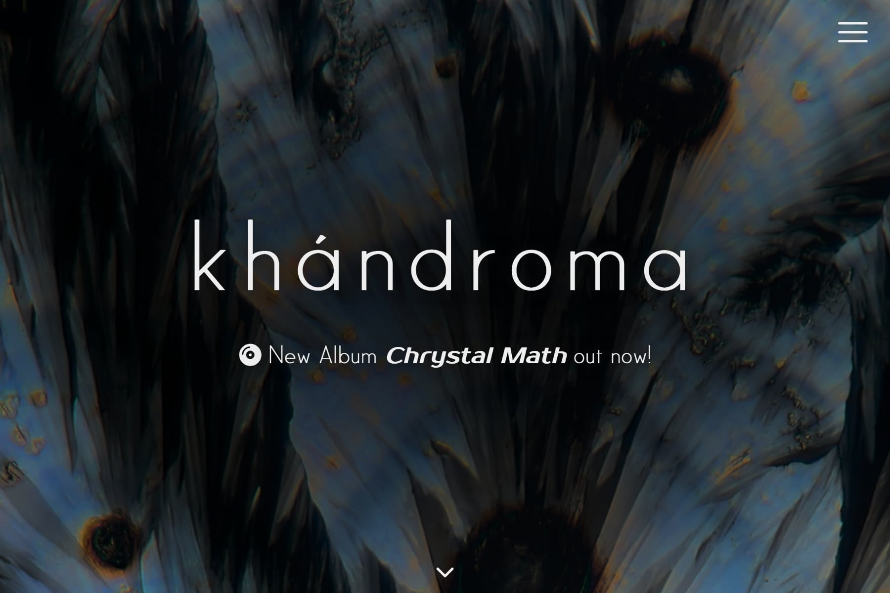
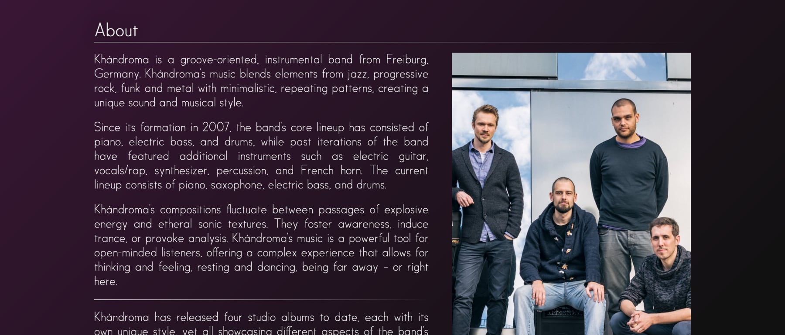
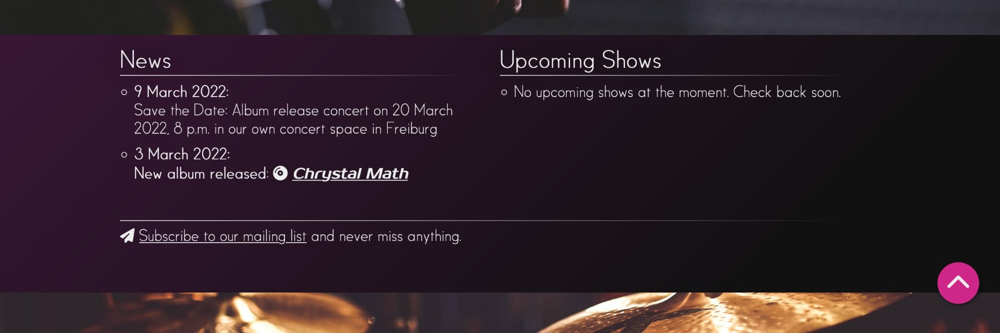
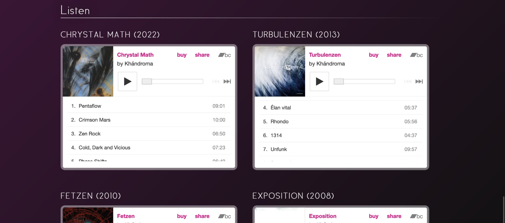
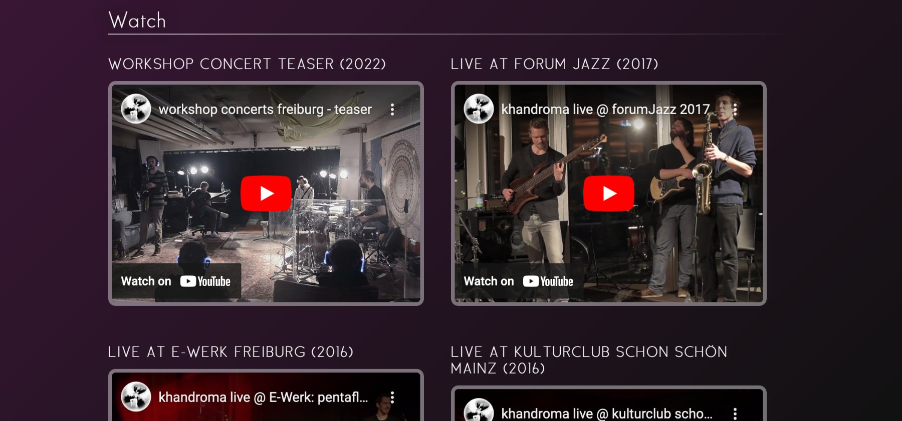
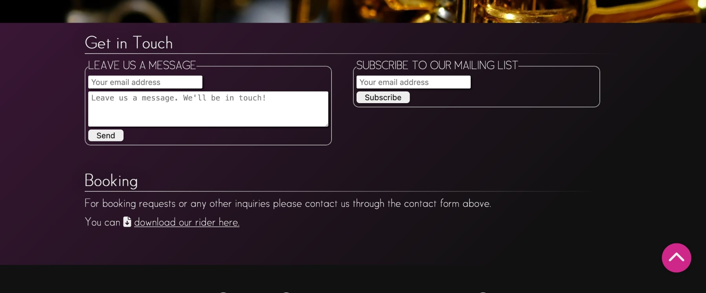
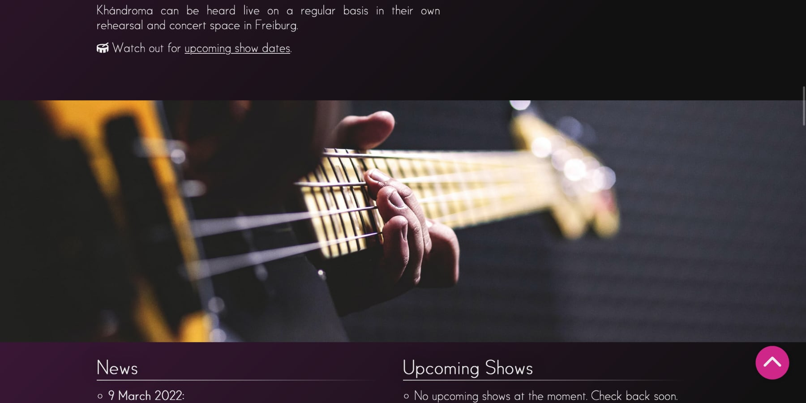

# Khándroma Band Website
This is the official website of the band *Khándroma* from Freiburg, Germany. It is the go-to resource to get information about the band, to stay informed about the band's recent activities like new releases or upcoming shows, and to listen to the band's music or watch videos of live performances. The website provides easy access to the band's social media profiles and options for getting in touch with the band.

The essential target groups of the website are potential new listeners, returning listeners/fans, booking agents, and other interested groups such as music journalists.

The main goals of the website are:
- to provide a central platform for fans, listeners and other interested groups, to access information about the band, their music and their current activities.
- to present up-to-date information about the bands activities, such as the latest releases and upcoming shows.
- to present the band's portfolio of music and live performance videos.
- to provide a visually appealing and professional looking online presence for the band, representing their artistic and musical style.
- to bring together the band's online content and social media profiles in one central place. 
- to provide means of getting in touch with the band for fans, listeners, and booking agents or journalists alike.

The live website can be found here: [https://nacht-falter.github.io/khandroma](https://nacht-falter.github.io/khandroma/index.html)

## Features

### Existing Features
 The website features a single page layout with visually distinct sections, allowing visitors to access all the information on the website without navigating multiple pages.
 
#### Header with hero image, site title and navigation menu
-  The website's header features the album artwork of the band's latest studio album.
- As a website title the band's name and an announcement of the recently released album are presented in the header.
- The header also features a navigation menu, which is hidden by default and can be accessed by clicking the hamburger menu icon in the top right corner. This presents a list of menu items linking to the main sections of the page.
- The header also features an animated clickable navigation button at the bottom of the screen, which indicates to users where to find the main content of the website.

#### About Section
The "About"section provides information on the band, their musical style and line-up and features a portrait image of the musicians.

#### News Section
The second section presents news and updates on the band's activities as well as upcoming show dates. It also contains a link to the mailing list subscription form at the bottom of the page.

#### Listen Section
The "Listen" section provides embedded music players enabling visitors to listen to the bands music. It also presents options to purchase the band's music.

#### Watch Section
The "Watch" section features embedded video players with videos from live performances of the band as well as a link to the bands YouTube channel.

#### Contact section
The last section of the page provides a contact form for getting in touch with the band and a form for subscribing to the band's mailing list. It also contains information on booking and provides a link to downlad the band's rider as a PDF file.

#### Section dividers
The website features large decorative images between the main sections, which are used to visually separate the sections and reflect the site's musical theme and aesthetic.

#### Footer
The site footer presents links to the band's social media profiles and a copyright notice.

#### Back-to-top button
Fixed at the bottom right of the viewport there is a clearly visible button, accessible from everywhere on the page, which brings the user back to the top of the page. This button only appears after scrolling down to the main content.

#### Responsive Layout
The website is fully responsive and features a flexible layout with a single column on small screens and two columns on larger screens.

### Features to be implemented in the future
#### Required features for an official release of the website
- Automatically close main navigation when a navigation item is clicked. This is not possible with plain HTML/CSS and requires some JavaScript. Then it also makes sense to make the navigation menu sticky, so that it can be accessed from anywhere on the page.
- Replace CI formdump form actions with an actual form handling method.   
- Replace stock images in image sections with pictures of the actual musicians.
- Add links to privacy policy page and imprint page in footer.
- Deploy finished website to https://khandroma.de

#### "Nice to have" features
- A favicon
- A photo gallery

## User Experience

### User stories
#### All Visitors
##### First Time Visitor Goals
-  As a first time visitor, I want to intuitively understand the purpose of the website. 
- As a first time visitor, I want to be able to easily navigate the website using a clear and intuitive navigation.
- As a first time visitor, I want the website to be optimized for mobile devices as well as larger screens, so that I can access the website from different devices.
- As a first time visitor, I want to be able to easily find information about the band in a concise and accessible way, so that I can learn about the band, their musical style, the line-up and about the musicians in the band.

##### Returning Visitor Goals
- As a returning user I want to access recently updated information, such as upcoming show dates and recent releases.
- As a returning visitor I want to be able to sign up to the band's e-mail newsletter in order to stay informed about upcoming events or releases.
- As a returning visitor I want to be able to contact the band, in order to get answers to any questions I might have or to provide some feedback.

#### Listeners
##### First Time Listener Goals
- As a first time listener, I want to get an overview over the band's music catalogue and be able to listen to the band's music through the website.
- As a first time listener I want to watch videos of the band's live shows in order to get an impression of their live performances and their vibe onstage.
- As a first time listener, I want to see some pictures of the band so that I can get an impression of the band and the musicians. 

##### Returning Listener Goals
- As a returning listener I want to find links to the band's social media profiles, so that I can connect with them through social media.
- As a returning listener I want to find information on how to purchase the band‘s music.

#### Venue owners/booking agents 
-   As a venue owner or booking agent, I want to be able to contact the band through the website so that I can ask about booking them for a performance.
- As a venue owner or booking agent, I want to be able to downlad a tech rider and other information, so that I can make an informed decision about booking the band for an event.

### Site owners goals
- Provide a platform for listeners and other interested groups like booking agents or journalists to access information about the band, their music, and upcoming shows.
- Present the band's portfolio of music, videos to give listeners and booking agents a feeling for the bands sound and musical style.
- Make it easy for listeners and fans to purchase the band's music by providing them with links to retail websites.
- Provide the option for listeners or fans to sign up for the band's newsletter and stay up-to-date on the latest news.
- Establish a visually appealing and professional looking online presence, which also fits to the artistic and musical style of the band.
- Make it easy for listeners or fans to share the band's music and upcoming events through social media by providing links to the bands social media pages.
- Make it easy for booking agents or journalists to find relevant information about the band and download additional information like a rider.
- Provide contact information for listeners as well as booking agents through a contact form to make it easy for them to get in touch with the band.

## Design

### Colour Scheme
The website uses two main colours:
- Pink (`#cf268a`) for accents like buttons and hover effects
- Purple (`#391635`) as the main background colour. This colour is used together with black (#111111) as colour gradients for the main section backgrounds, in order to give the site a more dynamic look.

### Typography
- The font "Satellite" designed by Matt Yow, is used as the main font of the website. It is a sans serif typeface with a modern, yet elegant look. It is used for the site title, headings (regular for level 1 and 2 headings, uppercase for level 3 headings) and paragraphs. [(Go to Credits section for font source)](#fonts)
- As a secondary typeface the font "Prosto", provided by *Google Fonts*, is used for the album title of the latest album release.
- These two fonts are also used on the cover of the fourth *Khándroma* studio album *Chrystal Math*.
- The icon library *Font Awesome* is used for additional icons.

### Images
- The hero image on the website features the album artwork from the band's latest studio album, which not only makes the header visually appealing, but also adds thematic relevance to the header by reflecting the band's current activities.
- A portrait photo of the band is presented in the "About" section.
- Large photos showing the instruments featured in the band's current line-up are used as decorative dividers between the main content sections to set the mood for the site and create a music related atmosphere. 

### Wireframes
[Wireframe for smartphones](media/wireframes/khandroma_wireframe_phone.png)

[Wireframe for tablets](media/wireframes/khandroma_wireframe_tablet.png)

[Wireframe for large screens](media/wireframes/khandroma_wireframe_desktop.png)

## Technologies Used

### Languages
- The website has been built with HTML and CSS. No JavaScript or other languages have been used.

### Libraries and Software 
#### [Font Awesome](https://fontawesome.com/)
- Font Awesome was used throughout the website to add icons for aesthetic and UX purposes. The necessary files have been included in the assets/fontawesome folder to avoid loading them from an external resource each time.

#### [Google Fonts](https://fonts.google.com/)
- Google fonts was used to import the 'Prosto' font into the stylesheet. The font file has been included in the assets/fonts folder, to ensure that it does not have to be loaded from an external resource. 

#### [Git](https://git-scm.com/)
- Git was used for version control by commiting changes to Git and push them to GitHub from the command line.

#### [GitHub](https://github.com/)
- GitHub is used to store the projects code after being pushed from Git and to deploy the website to GitHub pages at: https://nacht-falter.github.io/khandroma

#### [Pixelmator Pro](https://www.pixelmator.com/pro/)
- Pixelmator Pro was used to resize and edit images and photos for the website. 

#### [Balsamiq](https://balsamiq.com/)
- Balsamiq was used to create the [wireframes](#wireframes) during the design process.

## Testing

### W3C Validators
The [W3C Markup Validator](https://validator.w3.org) and [W3C CSS Validator](https://jigsaw.w3.org/css-validator/) services were used to validate the website and to ensure there were no syntax errors in the code.

The CSS validator initially only reported one issue with a CSS gradient declaration in the main stylesheet, which has been now fixed. Another issue came from the fontawesome.css stylesheet downloaded from https://fontawesome.com. That issue has been fixed by commenting out the lines of code in question. All remaining warnings refer to the stylesheets provided by FontAwesome.

The markup validator initially reported several issues with the site, most of which where either related to aria-label misuse or resulted from the embed code copied from YouTube and SoundCloud. All issues have now been fixed.

Here are the final results of the validators:

- [W3C Markup Validator results](https://validator.w3.org/nu/?doc=https%3A%2F%2Fnacht-falter.github.io%2Fkhandroma%2Findex.html) 
- [W3C CSS Validator results](https://jigsaw.w3.org/css-validator/validator?uri=https%3A%2F%2Fnacht-falter.github.io%2Fkhandroma%2Findex.html&profile=css3svg&usermedium=all&warning=1&vextwarning=&lang=en)

### Chrome Lighthouse
A report on the website generated with [Chrome Lighthouse](https://developer.chrome.com/docs/lighthouse/) initially showed a low performance value because the image files used on the website were to big. The images have since been replaced with more compressed versions (ensuring file sizes around 200kB), which has drastically improved the performance rating.

[Detailed Chrome Lighthouse results](media/testing/khandroma-lighthouse-results.pdf)

### Further Testing
- The website was tested on a variety of devices (Desktop, Laptop, iPad, and iPhone). The following browsers and operating systems have been tested: 

	- macOS
		- Firefox
		- Google Chrome
		- Safari
	- Microsoft Windows
		- Firefox
		- Google Chrome
		- Microsoft Edge 
	- Linux
		- Firefox
		- Google Chrome
	- iOS
		- Safari
		- Firefox
	  - iPadOS
		  - Safari
		  - Firefox
  
- The website worked as expected in all tested browsers, with two exceptions:
	1. In  all browsers on Microsoft Windows, the declaration `width: 100vh` on the hero image section caused a scrollbar to appear at the bottom of the page. This was fixed by setting the `width`  of the hero image to `100%`.
	2. On iPadOS the `text-shadow` effect on the site title was not displayed correctly. Since the intended possitive effect on readability was negligible on all devices, the issue was resolved by removing the declaration completely. 
- All links, buttons and forms where tested to make sure they work as expected.
- Friends and family members were asked to review the site and documentation to point out any bugs or user experience issues.

### Test user feedback:
- Multiple test users reported, they were confused, when the main navigation did not disappear automatically, after a menu item was clicked. This functionality could be implemented in the future using JavaScript (see [Future features](#features-to-be-implemented-in-the-future)). To avoid this problem, the navigation, for now, stays at the top of the page. Users can navigate back to the top of the page using the go-up button at the bottom right of the page.

### Known Bugs/Missing features
- The main navigation does not close automatically, when a menu item is clicked, which is not good UX. As a workaround the main navigation sticks to the top of the page for now so that it does not cover the page contents after clicking on a menu item. In the future this should be fixed by using some JavaScript to make the navigation disappear when clicking on a menu item.
- The hover effect on the hamburger button does not work properly on mobile devices, because hovering doesn't work with touchscreens. This feature is therefore disabled for smaller screens.
- The animations on the divider images between the main content sections sometimes look a bit jittery. So far, no solution for this has been found. One possibility would be to remove the animations completely, but this would make the website appear much less dynamic and atmospheric.

### Testing User Stories from User Experience Section
All user stories from the UX section have been tested. The results of these tests can be found here: [Testing User Stories](media/testing/user-stories-test.md)

## Deployment

### GitHub Pages
The site was deployed using GitHub pages. The steps used to the site deploy are as follows:

- Go to GitHub repository at https://github.com/nacht-falter/khandroma  
- In the GitHub repository, navigate to the Settings tab
- From the source section drop-down menu, select the Main Branch
- Once the Main branch has been selected, the page will be automatically refreshed with a detailed ribbon display to indicate the successful deployment.

The link to the live website can be found here: [https://nacht-falter.github.io/khandroma](https://nacht-falter.github.io/khandroma/index.html)

## Credits

### Code
- The main navigation design and the hamburger menu icon animation were inspired by and adapted from: [https://www.mediaevent.de/tutorial/css-responsive-menu.html](https://www.mediaevent.de/tutorial/css-responsive-menu.html) and [https://www.mediaevent.de/tutorial/css-transform.html](https://www.mediaevent.de/tutorial/css-transform.html). All code from these sources was reviewed thoroughly and adapted to fit the specific needs of this website.
- The use of CSS variables in general, and for media queries in particular, was inspired by:  [https://www.w3schools.com/css/css3_variables.asp](https://www.w3schools.com/css/css3_variables.asp) and [https://www.w3schools.com/css/css3_variables_mediaqueries.asp](https://www.w3schools.com/css/css3_variables_mediaqueries.asp )
- Breakpoints for media queries were adopted from [https://www.w3schools.com/css/css3_mediaqueries.asp](https://www.w3schools.com/css/css3_mediaqueries.asp). One additional breakpoint was added for screens wider than 1400px.
- The smooth scrolling feature was adapted from: [https://www.w3schools.com/cssref/pr_scroll-behavior.php](https://www.w3schools.com/cssref/pr_scroll-behavior.php)
- The use of CSS gradients as background-images was inspired by: [https://www.w3schools.com/css/css3_gradients.asp](https://www.w3schools.com/css/css3_gradients.asp)

### Content
- All content was written by the developer. The text for the "About" section was adapted from the official Khándroma press kit.

### Fonts
- Satellite (main font): [https://freetypography.com/2011/08/28/free-font-satellite](https://freetypography.com/2011/08/28/free-font-satellite)
- Prosto (only used for album title): [https://fonts.google.com/specimen/Prosto+One](https://fonts.google.com/specimen/Prosto+One)
- FontAwesome (for icons): [https://fontawesome.com/](https://fontawesome.com/)

### Media
#### Images:
- Band portrait foto by David Koetter 
- Divider image stock fotos:
	- Drums foto by Shawn Sim: [https://unsplash.com/photos/9lfubBqLbRc](https://unsplash.com/photos/9lfubBqLbRc)
	- Electric Bass foto by Freestocks: [https://unsplash.com/photos/Fx5rrxSaUtI](https://unsplash.com/photos/Fx5rrxSaUtI)
	- Saxophone foto by Oovstudio: [https://pixabay.com/photos/sax-instrument-saxophone-jazz-4372140](https://pixabay.com/photos/sax-instrument-saxophone-jazz-4372140/)
	- Piano foto by Andrew Faires: [https://unsplash.com/photos/NacLkmqiKnU](https://unsplash.com/photos/NacLkmqiKnU)

#### Music:
All music embedded on the website by Khándroma (https://khandroma.de)

#### Videos:
All videos embedded in the website by Khándroma (https://khandroma.de)

### Acknowledgements
- I would like to thank my Code Institute mentor for his continuous support and helpful advice.
- I would like to thank all Khándroma band members, family members, and friends who have tested the website for their helpful feedback and remarks.