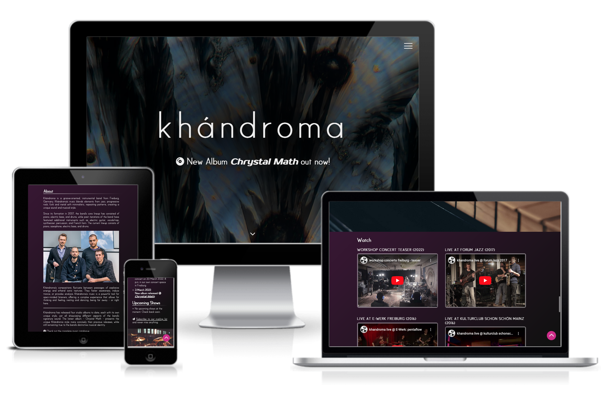

# Khándroma Band Website
This is the official website of the band *Khándroma* from Freiburg, Germany. It is the go-to resource to get information about the band, to stay informed about the band's recent activities like new releases or upcoming shows, and to listen to the band's music or watch videos of live performances. The website provides easy access to the band's social media profiles and options for getting in touch with the band.

The essential target groups of the website are potential new listeners, returning listeners/fans, booking agents, and other intersted groups such as music journalists.

The central goals of the website are:
- to provide a central platform for fans, listeners and other interested groups, to access information about the band, their music and their current activities.
- to present up-to-date information about the bands activities, such as the latest releases and upcoming shows.
- to present the band's portfolio of music and live performance videos.
- to provide a visually appealing and professional looking online presence for the band, representing their artistic and musical style.
- to bring together the band's online content and social media profiles in one central place. 
- to provide means of getting in touch with the band for fans, listeners, and booking agents or journalists alike.

The live website can be found here: [https://nacht-falter.github.io/khandroma](https://nacht-falter.github.io/khandroma/index.html)

## Features

## User Experience

### User stories
#### All Visitors
##### First Time Visitor Goals
-  As a first time visitor, I want to intuitively understand the purpose of the website. 
- As a first time visitor, I want to be able to easily navigate the website using a clear and intuitive navigation.
- As a first time visitor, I want the website to be optimized for mobile devices as well as larger screens, so that I can access the website from different devices.
- As a first time visitor, I want to be able to easily find information about the band in a concise and accessible way, so that I can learn about the band, their musical style, the line-up and about the musicians in the band.

##### Returning Visitor Goals
- As a returning user I want to access recently updated information, such as upcoming show dates and recent releases.
- As a returning visitor I want to be able to sign up to the band's e-mail newsletter in order to stay informed about upcoming events or releases.
- As a returning visitor I want to be able to contact the band, in order to get answers to any questions I might have or to provide some feedback.

#### Listeners
##### First Time Listener Goals
- As a first time listener, I want to get an overview over the band's music catalogue and be able to listen to the band's music through the website.
- As a first time listener I want to watch videos of the band's live shows in order to get an impression of their live performances and their vibe onstage.
- As a first time listener, I want to see some pictures of the band so that I can get an impression of the band and the musicians. 

##### Returning Listener Goals
- As a returning listener I want to find links to the band's social media profiles, so that I can connect with them through social media.
- As a returning listener I want to find information on how to purchase the band‘s music.

#### Venue owners/booking agents 
-   As a venue owner or booking agent, I want to be able to contact the band through the website so that I can ask about booking them for a performance.
- As a venue owner or booking agent, I want to be able to downlad a tech rider and other information, so that I can make an informed decision about booking the band for an event.

### Site owners goals
- Provide a platform for listeners and other interested groups like booking agents or journalists to access information about the band, their music, and upcoming shows.
- Present the band's portfolio of music, videos to give listeners and booking agents a feeling for the bands sound and musical style.
- Make it easy for listeners and fans to purchase the band's music by providing them with links to retail websites.
- Provide the option for listeners or fans to sign up for the band's newsletter and stay up-to-date on the latest news.
- Establish a visually appealing and professional looking online presence, which also fits to the artistic and musical style of the band.
- Make it easy for listeners or fans to share the band's music and upcoming events through social media by providing links to the bands social media pages.
- Make it easy for booking agents or journalists to find relevant information about the band and download additional information like a rider.
- Provide contact information for listeners as well as booking agents through a contact form to make it easy for them to get in touch with the band.

## Design

### Colour Scheme
The website uses two main colours:
- Pink (`#cf268a`) for accents like buttons and hover effects
- Purple (`#391635`) as the main background color.

### Typography
- The font "Satellite" designed by Matt Yow, is used as the main font of the website. It is a sans serif typeface with a modern but elegant look. It is used for the site title, headings (regular for level 1 and 2 headings, uppercase for level 3 headings) and paragraphs.
- As a secondary typeface the font "Prosto", provided by *Google Fonts*, is used for the album title of the latest album release.
- These two fonts are also used on the cover of the fourth *Khándroma* studio album *Chrystal Math*.
- The icon library *Font Awesome* is used for additional icons.

### Images
- The hero image on the website features the album artwork from the band's latest studio album, which not only makes the header visually appealing, but also adds thematic relevance to the header by reflecting the band's current activities.
- A portrait photo of the band is presented in the "About" section.
- To create musical vibes, large photos showing the instruments present in the band's current line up are used as decorative dividers between the main content sections to create a musical atmosphere. 

### Wireframes
[Wireframe for Smartphones](khandroma_wireframe_phone.png)
[Wireframe for Tablets](khandroma_wireframe_tablet.png)
[Wireframe for large Screens](khandroma_wireframe_desktop.png)

## Technologies Used

## Testing

## Deployment

### GitHub Pages

## Credits